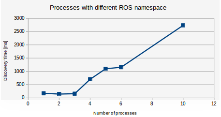
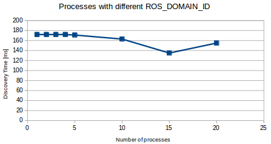

# Discovery time - Intraprocess

We want to measure how much time does it take for a publisher to discover all its subscribers.
Note that in these tests we run nodes all in the same process.


For more details on this topic refer to the [regression tests experiments](../regression/README.md).

To run the test:

```
ros2 run performance_test discovery_time_main --subs 5
```

The command takes as argument the number of subscribers that the publisher has to discover.


##### FastRTPS

 - **1 publisher 5 subscribers**: 10 milliseconds.
 - **1 publisher 10 subscribers**: 40 milliseconds (30% of the tests labeled as outliers with a discovery time of 40 seconds).
 - **1 publisher 15 subscribers**: 100 milliseconds (50% of the tests labeled as outliers with a discovery time of 40 seconds).

##### OpenSplice

The discovery time is less than 10 milliseconds even in case of 50 nodes or more.

##### Connext

Not able to run more than 8 nodes.

 - **1 publisher 7 subscribers**: 10% of the tests took 10 milliseconds. 30% of the tests took 2.8 seconds. 40% of the tests took 5.8 seconds. 10% of the tests timed out at 100 seconds.

# Discovery time - Interprocess

##### FastRTPS

Here we measure the discovery time of ROS systems running simultaneously, each under a different process. If all the ROS systems were to use the same topic name, the publishers of different processes would discover the subscribers present in all other processes. To avoid this, we try two approaches:

1. Use different ROS2 **namespaces** for each system:

```
ros2 run performance_test discovery_time_main --subs <N_SUBS> --ros_namespace <NAME1>
ros2 run performance_test discovery_time_main --subs <N_SUBS> --ros_namespace <NAME2>
ros2 run performance_test discovery_time_main --subs <N_SUBS> --ros_namespace <NAME3>
```

Nodes are said to be in a namespace or have a default namespace. Relative names are appended to the namespace of the node which creates them, for example a publisher who publishes to a topic "*/my_topic*" using a namespace "*my_namespace*", will end up publishing to a topic called "*/my_namespace/my_topic*".

Note that when using this approach, five ROS systems with each 1 pub and 5 subs will have a total of 30 nodes running on the same network. The discovery time for a publisher will be longer than if running only one system, due it has to find which of the 29 nodes are subscribed to its topic. This happens in what it's called the Participant Discovery Phase ([PDP](https://eprosima-fast-rtps.readthedocs.io/en/latest/advanced.html#discovery)).

2. Use different **ROS_DOMAIN_ID** for each system:

```
ROS_DOMAIN_ID=<ID1> ros2 run performance_test discovery_time_main --subs <N_SUBS>
ROS_DOMAIN_ID=<ID2> ros2 run performance_test discovery_time_main --subs <N_SUBS>
ROS_DOMAIN_ID=<ID3> ros2 run performance_test discovery_time_main --subs <N_SUBS>
```
The ROS_DOMAIN_ID is like a logical barrier to segregate networks, which allows us to use the same topic names on each system, so publisher won't discover subscribers of other processes than its own. In the case of 5 ROS systems with 1 pub and 5 subs each, the PDP its reduced to only match the 6 participants of each ROS system, no matter how many ROS systems are running simultaneously (if they all have set a different ROS_DOMAIN_ID).

#### ROS2 Crystal Master - FastRTPS 1.7.2 - x86_64

Test: Multiple processes running each a ROS system made up by:

 - **1 publisher 5 subscribers**

1. Using different ROS2 namespaces for each system:



The discovery time increases when increasing the amount of nodes running under the same network.

2. Using different ROS_DOMAIN_ID for each system:



The discovery time remains constant regardless or the amount of processes, due all of them are under a different ROS_DOMAIN_ID. Note that in the case of 20 processes there are 120 nodes running simultaneously, but as they are under different domain IDs, the PDP it's reduced to match only 6 participants.

