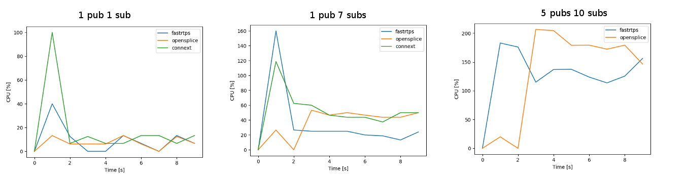

# ROS2 Pub/Sub CPU usage

How tu run CPU tests:
you can use the usual bash scripts, ensuring that this environment variable is set

```
$ export MON_CPU_RAM=true
```

Note that on a 4 cores machine, the CPU percentage of a process can go up to 400%.

## CPU Usage

```
$ source env.sh
$ export MAX_PUBLISHERS=1
$ export MAX_SUBSCRIBERS=10
$ export MSG_TYPES=10b
$ export PUBLISH_FREQUENCY=100
$ export DURATION=30
$ export NUM_EXPERIMENTS=10
$ export MON_CPU_RAM=true
$ bash scripts/pub_sub_ros2.sh
$ python scripts/plot_scripts/cpu_ram_plot.py <path_to_experiments> --x subs --y cpu --skip 5
```


## Different publish frequency or message sizes

In this experiments we considered a ROS2 system with 1 publisher and 1 subscriber

Changing the publishing frequencies or the size of the messages, the CPU usage changes almost proportionally.
Note that, for big message sizes, it will not be possible to reach the requested frequency. Thus the lines converge to the same values.

You can see the maximum publish frequencies in the [reliability analysis](../pub_sub_reliability/README.md).


```
$ source env.sh
$ export MAX_PUBLISHERS=1
$ export MAX_SUBSCRIBERS=1
$ export MSG_TYPES="10b 100b 250b 1kb 10kb 100kb 250kb 1mb"
$ export PUBLISH_FREQUENCY="10 100 500 1000"
$ export DURATION=30
$ export NUM_EXPERIMENTS=10
$ export MON_CPU_RAM=true
$ bash scripts/pub_sub_ros2.sh
$ python scripts/plot_scripts/cpu_ram_plot.py <path_to_experiments> --x msg_type --y cpu --separator send_frequency --skip 5
```


## Different DDS comparisons [X86_64]

We tested the differences in the CPU usage among the different DDS.
This test has been performed on a standard laptop due to the problems in cross-compiling OpenSPlice and Connext.

By default, the maximum number of nodes in the same process when using Connext is 8, thus we haven't been able to test bigger systems.

As we can see from the results, the overall performances of FastRTPS are better than other DDS.
We can analyze the two phases separately:

 - Nodes creation: all the DDS use an amount of CPU proportional to the number of nodes.
  The results are similar to the ones of the RAM requirements: OpenSplice and Connext scales better than FastRTPS. In particular OpenSplice requires a very small amount of CPU even for big systems.

 - Steady state: here FastRTPS works better and the difference with the other DDS increases with the size of the system. For the two experiments in which we have been able to test Connext, it has almost identical requirements to OpenSplice.





## Using different executors

We tested different ROS2 systems by running all the nodes in separate threads or within a single executor.
There are no noticeable differences between the two approaches.

