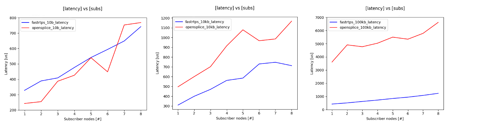

# Publisher/Subscriber latency

We want to show how the latency evolves as more nodes and/or topics are added to a ROS2 system.
Moreover latency is affected by the type of message being sent and by chosen the DDS implementation.

In a pub/sub system the latency is due to three factors: the serialization of a message on the publisher side, the transmission of the serialized message and the deserialization on the subscriber side.

This experiment instantiates some publisher nodes which stream messages of a certain type each on a different topic.
In the same process we also create several subscriber nodes. Each of them subscribes to all the available topics (as many as the publishers).


### Latency evaluation


```
$ source env.sh
$ export MAX_PUBLISHERS=1
$ export MAX_SUBSCRIBERS=1
$ export MSG_TYPES="10b 100b 250b 1kb 10kb 100kb 250kb 1mb 4mb 8mb"
$ export PUBLISH_FREQUENCY=1
$ export DURATION=30
$ export NUM_EXPERIMENTS=10
$ bash scripts/pub_sub_ros2.sh
$ python scripts/plot_scripts/ros_performance_plot.py results/pub_sub_ros2/rel_lat* --x msg_size --y latency
```

### Multiple subscribers/publishers evaluation

```
$ source env.sh
$ export MAX_PUBLISHERS=5
$ export MAX_SUBSCRIBERS=10
$ export MSG_TYPES=10b
$ export PUBLISH_FREQUENCY=100
$ export DURATION=30
$ export NUM_EXPERIMENTS=10
$ bash scripts/pub_sub_ros2.sh
$ python scripts/plot_scripts/ros_performance_plot.py results/pub_sub_ros2/rel_lat_1b_100hz --x subs --y latency --separator pubs
```


### Best effort vs Reliable mode


```
$ source env.sh
$ export MAX_PUBLISHERS=1
$ export MAX_SUBSCRIBERS=10
$ export MSG_TYPES=10b
$ export PUBLISH_FREQUENCY=100
$ export DURATION=30
$ export NUM_EXPERIMENTS=10
$ bash scripts/pub_sub_ros2.sh
```


### Static vs Dynamically allocated message fields


### Different DDS Latency [X86_64]


In this experiment we are going to look for differences in the latency among different DDS implementation.
These results have been collected on a standard laptop, that's why also for FastRTPS all the latency values will be much lower than the ones obtained in the previous experiments.

```
$ source env.sh
$ export RMW_IMPLEMENTATION=rmw_opensplice_cpp
$ export MAX_PUBLISHERS=1
$ export MAX_SUBSCRIBERS=8
$ export MSG_TYPES="10b 10kb 100kb"
$ export PUBLISH_FREQUENCY=100
$ export DURATION=30
$ export NUM_EXPERIMENTS=10
$ bash scripts/pub_sub_ros2.sh
```

The results show us how FastRTPS has a much lower latency of OpenSplice, expecially when comparing bigger messages.





### Different publish frequencies

While performing other experiments, we noticed that the increase in the publish frequency has a relevant impact on the latency.

```
$ source env.sh
$ export RMW_IMPLEMENTATION=rmw_opensplice_cpp
$ export MAX_PUBLISHERS=1
$ export MAX_SUBSCRIBERS=1
$ export MSG_TYPES="10b 100b 250b 1kb 10kb"
$ export PUBLISH_FREQUENCY="10 100 500 1000"
$ export DURATION=30
$ export NUM_EXPERIMENTS=10
$ bash scripts/pub_sub_ros2.sh
$ python/scripts/plot_scripts/latency_reliability_plot.py <path_to_experiments> --x msg_size --y latency --separator send_frequency
```


### Different processes latency

All the previous experiments have been done with all the nodes in the same process.
Now we want to measure the latency in case of nodes in different processes.

```
$ source env.sh
$ export MAX_PUBLISHERS=1
$ export MAX_SUBSCRIBERS=1
$ export MSG_TYPES="10b 10kb"
$ export PUBLISH_FREQUENCY=100
$ export DURATION=30
$ export NUM_EXPERIMENTS=10
$ bash scripts/pub_sub_separate_process.sh
$ python/scripts/plot_scripts/latency_reliability_plot.py <path_to_experiments> --x msg_size --y latency --separator directory
```

There is alsmost no difference in latency between the previous experiments, where nodes were running all in the same process, and this experiment, where publisher and subscribers are in two different processes.

This confirms that the FastRTPS DDS, which does not implement shared memory transportation, has to performs the same  steps for transmitting messages regardless of where the nodes are located.
