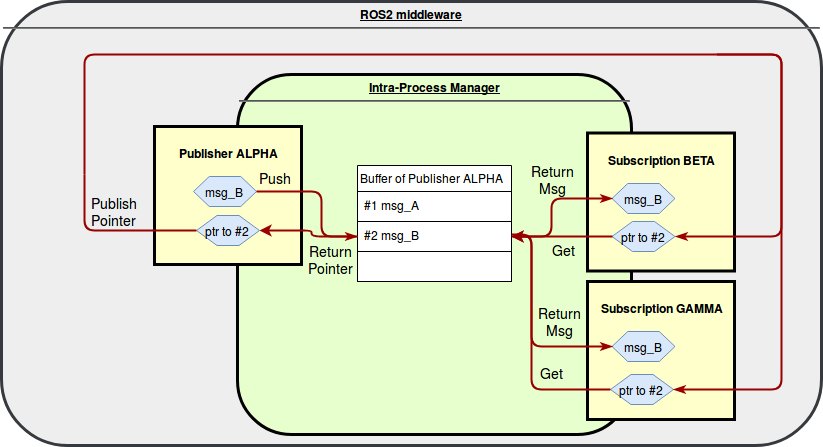
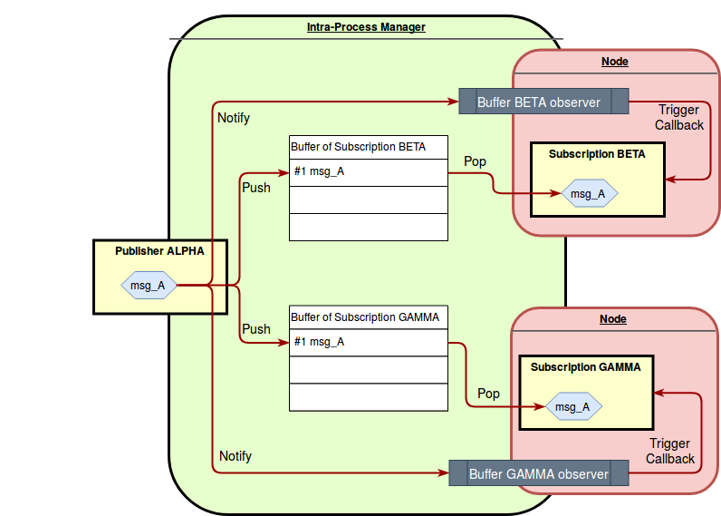

# Intra-process Communication Design

## Introduction

The subscriptions and publications mechanisms in ROS2 fall in two categories:

* intra-process: messages are sent from a publication to subscription via in-process memory
* inter-process: messages are serialized and sent via the underlying middleware.

This design document presents a new implementation for the intra-process communication.

## Motivations for a new implementation

ROS2 Dashing release will be the first ROS2 release featuring a working intra-process communication mechanism.

It is based on the creation of a ring buffer for each publisher and on the publication of meta-messages through
the middleware layer. When a `Publisher` has to publish in-process, it will pass the message to the
`IntraProcessManager`. Here the message will be stored in the ring buffer associated with the
`Publisher`. In order to retrieve a message, the `IntraProcessManager` needs two pieces of information:
the id of the publisher (in order to select the correct ring buffer) and the position of the message within
the ring buffer. A meta-message with this information is created and sent through the ROS2 middleware to all
the `Subscription`s, which can then retrieve the original message from the `IntraProcessManager`.



Several shortcomings of the current implementation are listed below.

### Incomplete Quality of Service support

The current implementation can't be used when the QoS durability value is set to `Transient Local`.

The current implementation does not enforce the depth of the QoS history in a correct way. The reason is that
there is a single ring buffer per `Publisher` and its size is equal to the depth of the `Publisher`'s history.
A `Publisher` stores a message in the ring buffer and then it sends a meta-message to allow a `Subscription` to retrieve it.
The `Subscription` correctly stores meta-messages up to the number indicated by its depth of the history, but,
depending on the frequency at which messages are published and callbacks are triggered, it may happen that a
meta-message processed from the `Subscription` does not correspond anymore to a valid message in the ring
buffer, because it has been already overwritten.

More details [here](https://index.ros.org/doc/ros2/Concepts/About-Quality-of-Service-Settings/).

**TODO:** take into account also new QoS: Deadline, Liveliness and Lifespan
[reference](https://github.com/ros2/design/pull/212).

### Dependent on the RMW

The current implementation has to send meta-messages from the `Publisher` to the `Subscription`s. This
is done using the `rmw_publish` function, the implementation of which depends on the chosen middleware. This
results in having the performance of a ROS2 application with IPC enabled to still heavily depend on the chosen
RMW implementation.

At the moment, all the ROS2 supported middlewares (Fast-RTPS, OpenSplice, Connext, DPS) do not make
distinctions whether the `Publisher` and the `Subscription` are in the same process or not. In consequence,
the use of meta-messages has an impact on the performance of the application.

##### Memory requirement

When a `Node` creates a `Publisher` or a `Subscription` to a topic `\MyTopic`, it will also create an
additional one to the topic `\MyTopic\intra_`. The second topic is the one where meta-messages travel. Our
[experimental results](https://github.com/irobot-ros/ros2-performance/tree/master/performances/experiments/crystal/pub_sub_memory#adding-more-nodes-x86_64)
show that creating a `Publisher` or a `Subscription` has a non-negligible memory cost.

Moreover, when using the default RMW implementation, Fast-RTPS, the memory consumed by a ROS2 application
increases almost exponentially with the number of `Publisher` and `Subscriptions`.

##### Latency and CPU utilization

Publishing a meta-message has the same overhead as that of publishing a small inter-process message.

However, comparing the publication/reception of an intra and an inter-process message, the former requires
several additional operations: it has to store the message in the ring buffer, monitor the number of
`Subscription`s, and extract the message.

The result is that from the latency and CPU utilization point of view, it is convenient to use inter-process
communication only when the message size is at least 5KB.


### Problems when both inter and intra-process communication are needed

The current implementation does not handle properly the situation in which it is necessary to publish both
inter and intra-process. The following two scenarios illustrate this problem.

##### Scenario 1

There are two processes. In the first process there are a `Publisher` and a `Subscription` to `\MyTopic`.
Both have IPC enabled. In the second process there is a `Subscription` to `\MyTopic`. It has IPC disabled.

In this case, the `Publisher` in the first process will publish both inter and intra-process. The IPC
meta-message will only be delivered to the `Subscription` within the same process through the
`\MyTopic\intra_` topic. However, the real message used for inter-process communication will be handled to the
RMW which does not have a notion of inter and intra-process communication. Consequently, the real message will
be delivered to both `Subscription`s present in the system. The `Subscription` that is in the same process as
the `Publisher` will actually discard the message, but it will be able to do that only after receiving and
deserializing it.

##### Scenario 2

There are two processes. In the first process there are a `Publisher` and a `Subscription` to `\MyTopic`.
Both have IPC enabled. In the second process there is a `Subscription` to `\MyTopic` and it has IPC enabled.

The difference with the first scenario is that now both `Subscription`s have IPC enabled.

The same phenomenon described before will still happen, i.e., the `Subscription` in the same process will
receive both the meta-message and the real message, and will discard the latter.

However, this time there is an additional problem: the meta-message is sent through the RMW on the
`\MyTopic\intra_` topic. Also, the `Subscription` in the second process will be listening to that topic. This
results in that the meta-message will be delivered to both `Subscription`s. The one in the second topic will
still try to use the meta-message to retrieve something from the `IntraProcessManager`. In this simple
scenario it will not be able to find anything and this will only result in a warning message. However, if some
`Publisher` with IPC ON happens to be present also in that process, then the `Subscription` will end up
extracting something from the ring buffer. This is due to the fact that the id of the publisher contained in
the meta-message is just an integer value guaranteed to be unique only within the process that generated it.

This situation has two possible outcomes: if the `Publisher` from which the message is extracted has the same
message type as the `Subscription`, then the problem will not be noticed, even if the `Subscription` is taking
a message that can potentially be old or destinated to a different consumer. On the other hand, if the
`Publisher` from which the message is extracted has a different message type from the one of the
`Subscription`, the `static_cast` operations performed by the `IntraProcessManager` will cause an access
violation error.


## Proposed implementation

### Overview

The new proposal for intra-process communication addresses all the issues previously mentioned. It has been
designed with performance in mind, so it avoids any communication through the middleware between nodes in the
same process. Moreover, it supports all the ROS2 Quality of Service configurations.

Consider a simple scenario, consisting of `Publisher`s and `Subscription`s all in the same process and with
the durability QoS set to `volatile`. The proposed implementation creates one buffer per `Subscription`. When
a message is published to a topic, its `Publisher` pushes the message into the buffer of each of the
`Subscription`s related to that topic and raises a notification, waking up the executor. The executor can then pop
the message from the buffer and trigger the callback of the `Subscription`.




The buffers store elements of type `std::shared_ptr<const MessageT>`. If the history QoS is set to `keep all`,
the buffers are dynamically allocated. On the other hand, if the history QoS is set to `keep last`, the
buffers have a size equal to the depth of the history and they act as ring buffers (overwriting the oldest
data when trying to push while its full). Ring buffers are not only used in `Subscription`s but also in each
`Publisher` with a durability QoS of type `transient local`.

The `IntraProcessManager` class stores all the ring buffers and also information about which `Publisher`s and
`Subscription`s are connected to each other.

A new class derived from `rclcpp::Waitable` is defined, denominated from hereafter `IPCWaitable`. An object of
this type is created by each `Subscription` with IPC turned on and it is used to notify the `Subscription`
that a new message has been pushed into its ring buffer and that it needs to be processed.

The decision whether to publish inter-process, intra-process or both is made every time the
`Publisher::publish()` method is called. For example, if the `NodeOptions::use_intra_process_comms_` is
enabled and all the known `Subscription`s are in the same process, then the message is only published
intra-process. This remains identical to the current implementation.

An initial, simplified implementation of the new IPC is hosted on [GitHub
here](https://github.com/alsora/rclcpp/tree/alsora/rebase_ipc).

### Creating a publisher

1. User calls `Node::create_publisher<MessageT>(...)`.
2. If IPC is enabled, this boils down to
   `IntraProcessManager::add_publisher(PublisherBase::SharedPtr publisher, PublisherOptions options)`.
3. `IntraProcessManager::add_publisher(...)` stores the `Publisher` information in an internal structure of
   type `IPCPublisher_info_t`. The structure contains information about the `Publisher` such as its QoS. If
   the `Publisher` QoS is set to `transient local`, then the structure will also contain a ring buffer of the
   size specified by the depth from the QoS. The `IntraProcessManager` contains a
   `std::map<std::string, std::vector<IPCPublisher_info_t>>` object where
   it is possible to retrieve all the `IPCPublisher_info_t` related to a specific topic.
   The function returns an integer `pub_id` that allows to retrieve the `IPCPublisher_info_t` and that is stored
   within the `Publisher`.

### Creating a subscription

1. User calls `Node::create_subscription<MessageT>(...)`.
2. If IPC is enabled, this boils down to
   `IntraProcessManager::add_subscription(SubscriptionBase::SharedPtr subscription, SubscriptionOptions options)`.
3. `IntraProcessManager::add_subscription(...)` stores the `Subscription` information in an internal structure
   of type `IPCSubscription_info_t`. The structure will always contain a ring buffer of the size specified by
   the depth from the QoS. The `IntraProcessManager` contains a
   `std::map<std::string, std::vector<IPCSubscription_info_t>>` object where
   it is possible to retrieve all the `IPCSubscription_info_t` related to a specific topic.
4. If IPC is enabled, `Node::create_subscription<MessageT>(...)` also creates a new `IPCWaitable : Waitable`
   object associated with the new `Subscription`. The `IPCWaitable` needs to have access to the ring buffer
   and to the `Subscription::any_callback` function pointer. It has an associated `rcl_guard_condition_t`
   object that can be triggered from the `IntraProcessManager`.
5. The new `IPCWaitable` object is added to the list of Waitable interfaces of the node through
   `node_interfaces::NodeWaitablesInterface::add_waitable(...)`.

The following steps will be executed if the `Subscription` QoS is set to `Transient Local`.
In this case the `IntraProcessManager` has to check if the recently created `Subscription` is a late-joiner, and in that case,
retrieve messages from the `Transient Local` `Publisher`s.

6. Call `IntraProcessManager::find_matching_publishers(IPCSubscription_info_t sub_info)` that returns a list
   of stored `IPCPublisher_info_t` that have a QoS compatible for sending messages to this new `Subscription`.
7. Check if any of these `Publisher` have a transient local QoS. If this is the case, they will have a ring
   buffer.
8. Copy messages from all the ring buffers found into the ring buffer of the new `Subscription`. **TODO:** are
   there any constraints on the order in which old messages have to be retrieved? (i.e. 1 publisher at the
   time; all the firsts of each publisher, then all the seconds ...).
9. If at least 1 message was present, trigger the `rcl_guard_condition_t` member of the `IPCWaitable`
   associated with the new `Subscription`.
   **TODO:**: is this necessary? When a `Node` starts to spin all the `IPCWaitable` objects are checked, so,
   if the subscription is created during the `Node` constructor this last step would not be needed. Moreover,
   there should also be a guard condition that awakes `rclcpp::spin` every time a new entity is added.


### Publishing only intra-process

##### unique_ptr case

1. User calls `Publisher::publish(std::unique_ptr<MessageT> msg)`.
2. `Publisher::publish(std::unique_ptr<MessageT> msg)` calls
   `IntraProcessManager::do_intra_process_publish(int pub_id, std::shared_ptr<MessageT> shared_msg)`, where
   `std::shared_ptr<MessageT> shared_msg = std::move(msg)`.
3. `IntraProcessManager::do_intra_process_publish(...)` uses the `int pub_id` to select the
   `IPCPublisher_info_t` structure associated with this publisher. Then it calls
   `IntraProcessManager::find_matching_subscriptions(IPCPublisher_info_t pub_info)`. This returns a list of
   stored `IPCSubscription_info_t` that have a QoS compatible for receiving the message.
4. If the `Publisher` QoS is set to transient local, its `IPCPublisher_info_t` is also added to the list.
5. A copy of the `std::shared_ptr<MessageT> msg` is pushed to the ring buffer of all the items in the list.
   The `rcl_guard_condition_t` member of `IPCWaitable` of each `Subscription` is triggered (this wakes up
   `rclcpp::spin`).

This mechanism requires to copy the `MessageT` smart pointer N+1 times, where N is the number of
`Subscription`s.

##### shared_ptr case

1. User calls `Publisher::publish(std::shared_ptr<MessageT> msg)`.
2. `Publisher::publish(std::shared_ptr<MessageT> msg)` calls
   `IntraProcessManager::do_intra_process_publish(int pub_id, std::shared_ptr<MessageT> shared_msg)`, where
   `std::shared_ptr<MessageT> shared_msg = std::make_shared(*msg)`.

Then apply steps 3, 4 and 5 as seen above.

This mechanism requires to copy the `MessageT` once and its smart pointer N+1 times, where N is the number of
`Subscription`s.


### Receiving intra-process messages

As previously described, whenever messages are added to the ring buffer of a `Subscription`, a condition
variable specific to the `Subscription` is triggered. This condition variable has been added to the `Node` waitset
so it is being monitored by the `rclcpp::spin`

Remember that the `IPCWaitable` object has access to the ring buffer and to the callback function pointer of
its related `Subscription`.

1. The guard condition linked with the `IPCWaitable` object awakes `rclcpp::spin`.
2. The `IPCWaitable::is_ready()` condition is checked. This has to ensure that the ring buffer is not empty.
3. The `IPCWaitable::execute()` function is triggered. Here the first message is extracted from the buffer and
   then the `IPCWaitable` calls the `AnySubscriptionCallback::dispatch(std::shared_ptr<MessageT> msg)` method.
4. Depending on the type of the callback associated with the `AnySubscriptionCallback` object, the
   message may be copied or not. This is the case in which the callback requires a
   `std::unique_ptr<MessageT> msg`.
   In all the other cases it is sufficient to pass the `std::shared_ptr<MessageT> msg` extracted from the queue.


### Handling intra and inter-process communications

### Setting up the middleware

In order to avoid the issue previously described, i.e., that a `Subscription` would receive both inter and
intra-process messages, it is necessary to inform the underlying middleware that some "connections" will be
handled at the `rclcpp` level, enabling the RMW to neglect them.

This could be implemented alongside some sort of intra-process discovery. When a `Publisher` and a
`Subscription` to the same topic with compatible QoS are added to the `IntraProcessManager`, it is not
necessary for them to be also connected at the ROS2 middleware level. They are supposed to communicate
only intra-process.

One of the main obstacles in implementing an intra-process discovery is that in all the middleware
implementations currently available for ROS2, the discovery is not triggered by the user, but simply
starts as soon as a node is created. Moreover, even if a `Publisher` and a `Subscription` are in the same process,
it is not guaranteed that both will have intra-process communication enabled.

The proposed solution is to declare two new functions in the `rmw_implementation` layer:
 - `rmw_ret_t disconnect_remote_publisher(rmw_node_t node, rmw_subscription_t sub, rmw_publisher_t remote_pub)`
 - `rmw_ret_t disconnect_remote_subscription(rmw_node_t node, rmw_publisher_t pub, rmw_subscription_t remote_sub)`

These will be called from the `IntraProcessManager` on each matching of a `Publisher` and a `Subscription`.
Then, each RMW can implement them in order to improve the performance for this particular situation.

The following is an example of how they could be implemented.

##### Fast-RTPS

Each of the following classes, `rmw_node_t`, `rmw_publisher_t` and `rmw_subscription_t` contain a pointer to
the underlying RTPS object that is implementing.

The `EDP` class in Fast-RTPS provides the following functions:

 - `bool EDP::unpairWriterProxy(const GUID_t& participant_guid, const GUID_t& writer_guid)`
 - `bool EDP::unpairReaderProxy(const GUID_t& participant_guid, const GUID_t& reader_guid)`

These functions perform exactly what is needed: they disconnect a remote `Publisher` or a remote
`Subscription` from a `Node`. The arguments needed can be easily obtained at the `rmw_fastrtps` layer:
`rmw_node_t` contains the `participant_guid`, while `rmw_publisher_t` and `rmw_subscription_t` contain the
`writer_guid` and the `reader_guid`.


### Publishing intra and inter-process

1. User calls `Publisher::publish(std::unique_ptr<MessageT> msg)`.
2. The message is moved into a shared pointer `std::shared_ptr<MessageT> shared_msg = std::move(msg)`.
3. `Publisher::publish(std::unique_ptr<MessageT> msg)` calls
   `IntraProcessManager::do_intra_process_publish(int pub_id, std::shared_ptr<MessageT> shared_msg)`.

The following steps are identical to steps 3, 4 and 5 applied when publishing only intra-processs.

4. `IntraProcessManager::do_intra_process_publish(...)` uses the `int pub_id` to select the
   `IPCPublisher_info_t` structure associated with this publisher. Then it calls
   `IntraProcessManager::find_matching_subscriptions(IPCPublisher_info_t pub_info)`. This returns a list of
   stored `IPCSubscription_info_t` that have a QoS compatible for receiving the message.
5. If the `Publisher` QoS is set to transient local, its `IPCPublisher_info_t` is also added to the list.
6. A copy of the `std::shared_ptr<MessageT> msg` is pushed to the ring buffer of all the items in the list.
   The `rcl_guard_condition_t` member of `IPCWaitable` of each `Subscription` is triggered (this wakes up
   `rclcpp::spin`).

After the intra-process publication, the inter-process one takes place.

7. `Publisher::publish(std::unique_ptr<MessageT> msg)` calls
   `Publisher::do_inter_process_publish(const MessageT * msg_ptr)`.
   Where `MessageT * msg_ptr = shared_msg.get()`.

This does not require any further message copies compared to the only intra-process case. This is also true
when calling `Publisher::publish(std::shared_ptr<MessageT> msg)`.


##### QoS features

The proposed implementation can handle all the different QoS.

 - If the history is set to `keep_last`, then the depth of the history corresponds to the size of the ring
   buffer. On the other hand, if the history is set to `keep_all`, the buffer becomes a standard FIFO queue
   with an unbounded size.
 - The reliability is only checked by the `IntraProcessManager` in order to understand if a `Publisher` and a
   `Subscription` are compatible. The use of buffers ensures that all the messages are delivered without
   the need to resend them. Thus, both options, `reliable` and `best-effort`, are satisfied.
 - If the `Publisher` durability is set to `transient_local` an additional buffer on the `Publisher` side
   is used to store the sent messages.
   Besides this, the durability QoS is used to understand if a `Publisher` and a `Subscription` are compatible.


## Perfomance evaluation

The following results have been obtained running our benchmark application with the topologies Sierra Nevada and Mont Blanc.
Sierra Nevada is a 10-node topology and it contains 10 publishers and 13 subscriptions. One topic has a message size of
10KB, while all the others have message sizes between 10 and 100 bytes.

Mont Blanc is a bigger 20-node topology, containing 23 publishers and 35
subscriptions. Two topics have a message size of 250KB, three topics have message sizes between
1KB and 25KB, and the rest of the topics have message sizes smaller than 1KB.

A detailed description and the source code for these application and topologies can be found
[here](https://github.com/irobot-ros/ros2-performance/tree/master/performances/benchmark).

All the following experiments have been run using the ROS2 Master branch (20th May 2019) and with `-O2`
optimization enabled.

```
colcon build --cmake-args  -DCMAKE_CXX_FLAGS="-O2" -DCMAKE_C_FLAGS="-O2"
```

Performance evaluation on a laptop computer with Intel i7-6600U CPU @ 2.60GHz.

| ROS2 system                   |  IPC     |    DDS        | Latency [us] | CPU [%] | RAM [Mb] |
| -------------                 |  -----   | ------------- | ------------ | ------- | -------- |
| Sierra Nevada                 |   off    | Fast-RTPS     |      600     |   14    |    63    |
| Sierra Nevada                 | standard | Fast-RTPS     |      650     |   16    |  73->79  |
| Sierra Nevada                 |   new    | Fast-RTPS     |      140     |    8    |    63    |
| Mont Blanc                    |   off    | Fast-RTPS     |     1050     |   22    |   180    |
| Mont Blanc                    | standard | Fast-RTPS     |      750     |   18    | 213->220 |
| Mont Blanc                    |   new    | Fast-RTPS     |      160     |    8    |   180    |

A similar behavior can be observed also running the application on resource constrained platforms.
The following results have been obtained on a RaspberryPi 2.

| ROS2 system                   |  IPC     |    DDS        | Latency [us] | CPU [%] | RAM [Mb] |
| -------------                 |  -----   | ------------- | ------------ | ------- | -------- |
| Sierra Nevada                 |   off    | Fast-RTPS     |      800     |   18    |    47    |
| Sierra Nevada                 | standard | Fast-RTPS     |      725     |   20    |  54->58  |
| Sierra Nevada                 |   new    | Fast-RTPS     |      170     |   10    |    47    |
| Mont Blanc                    |   off    | Fast-RTPS     |     1500     |   30    |   130    |
| Mont Blanc                    | standard | Fast-RTPS     |      950     |   26    | 154->159 |
| Mont Blanc                    |   new    | Fast-RTPS     |      220     |   14    |   130    |

For what concerns latency and CPU usage, Sierra Nevada behaves almost the same regardless if standard IPC is enabled or not.
This is due to the fact that most of its messages are very small in size. On the other hand, there are noticeable improvements in Mont
Blanc, where several messages of non-negligible size are used.

From the memory point of view, there is an almost constant increase in the utilization
during the execution of the program when standard IPC mechanism is used. Since the experiments have been run for
120 seconds, there is an increase of approximately 60KB per second. However, even considering
the initial memory usage, it is possible to see how it is affected from the presence of the additional publishers and
subscriptions needed for intra-process communication. There is a difference of 10MB in Sierra Nevada and
of 33MB in Mont Blanc between standard IPC on and off.

The last experiment show how the current implementation performs in the case that both intra and
inter-process communication are needed. The test consists of running Sierra Nevada on RaspberryPi 2, and,
in a separate desktop machine, a single node subscribing to all the available topics coming from Sierra Nevada.
This use-case is common when using tools such as `rosbag` or `rviz`.

| ROS2 system                   |  IPC     |    DDS        | Latency [us] | CPU [%] | RAM [Mb] |
| -------------                 |  -----   | ------------- | ------------ | ------- | -------- |
| Sierra Nevada + debug node    |   off    | Fast-RTPS     |      800     |   22    |    50    |
| Sierra Nevada + debug node    | standard | Fast-RTPS     |     1100     |   35    |  60->65  |
| Sierra Nevada + debug node    |   new    | Fast-RTPS     |      180     |   15    |    32    |


These results show that if there is at least one node in a different process, with the current implementation
it is better to keep intra-process communication disabled. The proposed implementation does not require the
ROS2 middleware when publishing intra-process. This allows to easily remove the connections between nodes in
the same process when it is required to publish also inter process, potentially resulting in a very small
overhead with respect to the only intra-process case.


## Open Issues

There are some open issues that are not addressed neither on the current implementation nor on the
proposed one.

 - The proposal does not take into account the problem of having a queue with twice the size when both inter
   and intra-process communication are used. A node with a history depth of 10 will be able to store up to
   20 messages without processing them (10 intra-process and 10 inter-process). This issue
   is also present in the current implementation, since each `Subscription` is doubled.

 - The proposal does not allow to handle the scenario in which a `transient local` `Publisher` has only
   intra-process `Subscription`s when it is created, but, eventually, a `transient local` `Subscription` in a
   different process joins. Initially, published messages are not passed to the middleware, since all the
   `Subscription`s are in the same process. This means that the middleware is not able to store old messages
   for eventual late-joiners.

## Future works

 - Depending on the size of `MessageT`, storing a `std::shared_ptr<MessageT>` may not be the most efficient
   solution: if the message size is very small, it should be possible to directly store copies of the messages
   in the intra-process ring buffers for improved performance.
